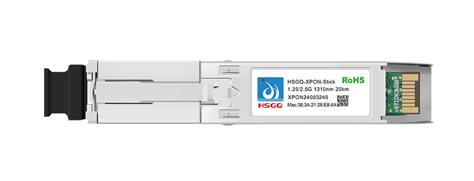
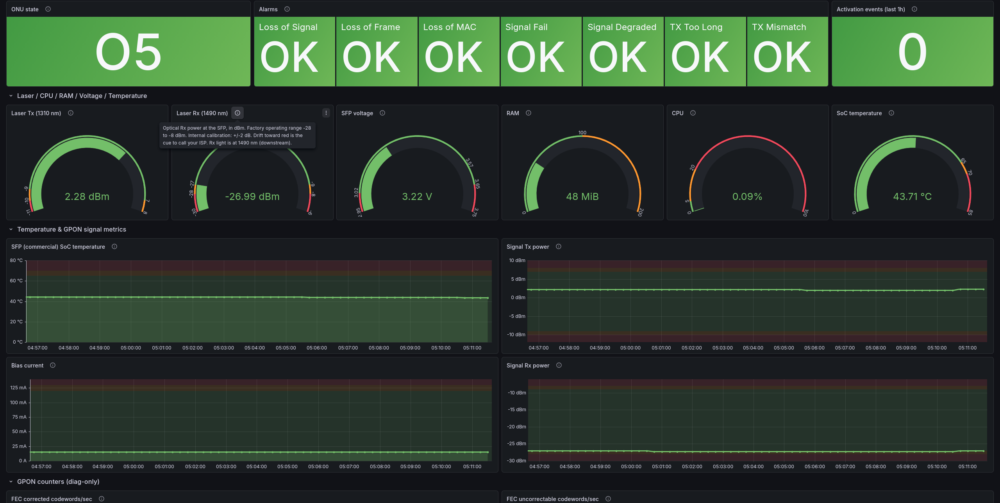

# GPON

This repo ships:

- **`gpon_exporter.py`** -- a Python Prometheus exporter that scrapes
  ~75 metrics from an [HSGQ / ODI](https://www.hsgq.com/XPON-Stick-Full-Form-Customized-pd597593578.html)
  (Realtek RTL960x) GPON SFP over SSH, using the on-device `diag` and
  `omcicli` CLIs.
- **`dashboard.json`** -- a Grafana dashboard that visualises those
  metrics: optical readings, alarms, ONU state, FEC/BIP/PLOAM/BWMAP
  counters, and collector self-health.
- **`firmware/`** -- the four known M110 SFU and M114/V1.1.3 HGU firmware
  tarballs, mirrored on the [Releases](https://github.com/Strykar/GPON/releases) page.
- **`docs/`** -- the SFP spec sheet, user manual, an EPON/GPON activation
  paper, plus [QUIRKS](docs/QUIRKS.md), [COVERAGE](docs/COVERAGE.md),
  [TROUBLESHOOTING](docs/TROUBLESHOOTING.md), and [MIGRATION](docs/MIGRATION.md).

If you can't SSH into the SFP, the Lua web-scraper at
[Anime4000/RTL960x discussion #466](https://github.com/Anime4000/RTL960x/discussions/466)
is the alternative.





> Upgrading from a pre-v1.0.0 install? See [docs/MIGRATION.md](docs/MIGRATION.md).

## How to use

If you don't already run Prometheus + Grafana, the fastest path is the
bundled compose stack:

```sh
cp .env.example .env             # fill in ONU_SSH_PASSWORD
docker compose up -d --build     # --build only needed pre-1.1
open http://localhost:3000       # admin / admin, dashboard already loaded
```

That brings up exporter + Prometheus + Grafana with the dashboard
auto-provisioned. See [Docker / Podman](#docker--podman) for the
exporter-only variant when you already have observability infra.

The manual path (no docker), shortest version:

```sh
# 1. install runtime deps -- pick ONE of these (see Requirements below)
sudo pacman -S python-paramiko python-prometheus_client    # Arch
# OR
sudo apt install python3-paramiko python3-prometheus-client  # Debian/Ubuntu
# OR
python3 -m venv .venv && .venv/bin/pip install -r requirements.txt  # any distro

# 2. run the exporter against your SFP
export ONU_SSH_PASSWORD='your-password-here'
python3 gpon_exporter.py --device admin@192.168.1.1
# /metrics now serves on http://127.0.0.1:8114/metrics

# 3. point Prometheus at it
#    scrape_configs:
#      - job_name: gpon_exporter
#        static_configs:
#          - targets: ['127.0.0.1:8114']

# 4. import dashboard.json into Grafana, pick the appropriate Prometheus datasource.
```

A `scrape_interval` between the exporter's `--interval` (default 5m) and
~30s works fine; matching `--interval` is cleanest. Anything faster just
returns the same value across multiple scrapes -- harmless but wasteful.
Prometheus auto-sets the `instance` label to the target string, so no
explicit `labels:` block is needed unless you want a friendly override.

For long-running deployments use the systemd unit ([systemd](#systemd)) or
the Docker compose file ([Docker / Podman](#docker--podman)) instead of
running by hand. Multi-ONU and Proxmox/LXC are documented further down.

If something doesn't look right, the first thing to run is
`gpon_exporter.py --diagnose` -- see [docs/TROUBLESHOOTING.md](docs/TROUBLESHOOTING.md).

## What it exposes

~75 metrics in total -- optical readouts, ONU state, alarms, downstream
PHY/PLOAM/BWMAP/OMCI/Ethernet/GEM counters, upstream counters, activation,
rogue-SD, optional OMCI extras, and exporter self-health. Full per-metric
tables grouped by category live in [docs/COVERAGE.md](docs/COVERAGE.md).

All cumulative device counters are real Prometheus **Counters** with a
`_total` suffix; use `rate(metric_total[15m])` in dashboards and alerts.

## Running it

### Requirements

Two runtime deps: `paramiko>=3.0` and `prometheus_client>=0.17`. Both are
in standard distro repos -- prefer them over `pip` so you don't have to
opt out of PEP 668 with `--break-system-packages` and risk a broken
system Python.

```sh
sudo pacman -S python-paramiko python-prometheus_client      # Arch
sudo apt install python3-paramiko python3-prometheus-client  # Debian/Ubuntu/Proxmox LXC
```

If you need a newer version than your distro ships, or you're on a system
without those packages, use a venv (never `pip install` into the system
interpreter on a modern distro):

```sh
python3 -m venv .venv
.venv/bin/pip install -r requirements.txt
# then run with .venv/bin/python3 instead of plain python3
```

The repo also ships a `pyproject.toml`, so `pip install .` (inside a
venv) installs `gpon-exporter` as a console-script entry point on
PATH. The `requirements.txt` path remains supported for users who
prefer running the script directly.

### Standalone

```sh
python3 gpon_exporter.py \
  --device "admin:$ONU_SSH_PASSWORD@192.168.1.1:22" \
  --webserver-port 8114
```

The `--device` flag takes a `user:password@host[:port]` connection string;
port defaults to 22 if omitted. Password may also be left out, in which
case `ONU_SSH_PASSWORD` from the environment is used:

```sh
export ONU_SSH_PASSWORD='your-password-here'
python3 gpon_exporter.py --device admin@192.168.1.1
```

The env-var path is preferable so the password doesn't appear in `ps`
output. Multiple ONUs: pass `--device` once per ONU. Each can have its own
embedded password, or all can fall back to the same env var:

```sh
python3 gpon_exporter.py \
  --device admin:p1@10.0.0.1 \
  --device admin:p2@10.0.0.2:2222
```

The metrics endpoint binds to `127.0.0.1` by default (loopback only). If
your Prometheus runs on a different host, pass `--bind-address 0.0.0.0`.
Inside Docker/Podman the compose file already does this for you.

If you bind to `0.0.0.0` on a network reachable from outside your
trusted segment, put auth and TLS in front of `/metrics` -- the
exporter doesn't do either. Caddy or nginx as a reverse proxy with
basic auth is the lowest-effort path; oauth2-proxy or
prometheus-with-scrape-tls suit larger setups. The metrics themselves
contain device-fingerprinting information (firmware version, MAC,
serial, optical levels) that's worth not publishing.

### systemd

The repo's `odi.service` is the canonical example: hardened
(`DynamicUser=yes`, `StateDirectory=`, `NoNewPrivileges`, capability
strip, address-family/namespace restrictions), env-file based password,
no `After=sshd.service` (the collector is an SSH client, not a server),
sensible `RestartSec`/`StartLimit*` paired with the daemon's
exit-on-auth-failure behaviour.

Drop the unit in `/etc/systemd/system/`, edit the SFP address and
webserver port in `ExecStart=`, then create the credentials file at
`/etc/gpon-exporter/credentials` with exactly:

```sh
ONU_SSH_PASSWORD=your-password-here
```

```sh
sudo install -m 0600 -o root -g root /dev/null /etc/gpon-exporter/credentials
sudo "$EDITOR" /etc/gpon-exporter/credentials
sudo systemctl daemon-reload
sudo systemctl enable --now odi
```

The 0600 + root-owned permissions matter -- systemd does not enforce
them, and a 0644 file with `ONU_SSH_PASSWORD=...` is a foot-gun on a
multi-user host. Even with `DynamicUser=yes`, the credentials file is
read by systemd itself before privileges drop, so the dynamic UID
never reads it directly. The known-hosts file is auto-created at
`/var/lib/gpon-exporter/known_hosts` (managed by `StateDirectory=`,
owned by the dynamic UID, persisted across restarts and reboots).

### Docker / Podman

Two compose files ship with the repo:

| File | Brings up | Pick this if |
| --- | --- | --- |
| `docker-compose.yml` | Exporter + Prometheus + Grafana (dashboard auto-provisioned) | You don't already run observability infra. Open `http://localhost:3000` after `up`. |
| `docker-compose.exporter-only.yml` | Just the exporter | You already have Prometheus + Grafana and want to wire this exporter into them. |

Both pull `ghcr.io/strykar/gpon-exporter:latest` and fall back to building
from local source if the image isn't present. Locally tested with podman
5.8.2 + podman-compose; the docker path is the same syntax.

**Full stack (recommended for first-time users):**

```sh
cp .env.example .env             # fill in ONU_SSH_PASSWORD (and optionally GRAFANA_ADMIN_PASSWORD)
docker compose up -d             # docker engine + the compose plugin
# or: podman compose up -d
open http://localhost:3000       # admin / admin on first login (Grafana forces a change)
```

The Grafana dashboard appears in the dashboards list on first login,
already pointed at the bundled Prometheus. Both UIs bind to
`127.0.0.1` only -- edit the `ports:` lines in `docker-compose.yml` if
you want LAN access.

**Exporter-only (existing Prometheus / Grafana):**

```sh
cp .env.example .env             # fill in ONU_SSH_PASSWORD
docker compose -f docker-compose.exporter-only.yml up -d
# /metrics serves on http://127.0.0.1:8114/metrics
# Add it to your existing prometheus.yml, then import dashboard.json into Grafana.
```

The container's `HEALTHCHECK` (pulls `/metrics`, marks unhealthy on
failure) only takes effect when the image is built with the docker
manifest format. Docker uses that format by default; podman defaults to
OCI and silently ignores `HEALTHCHECK`. To honour it under podman, build
with `podman build --format docker -t gpon-exporter:latest .` first, then
bring the stack up. Without that flag the exporter still runs fine, you
just don't get healthy/unhealthy status in `podman ps`.

**Both compose files are single-device.** Multiple SFPs need either
`docker compose -p` (or `podman compose -p`) per device with separate
`.env` files, or a manual multi-service rewrite.

**Podman + systemd**: skip `podman compose` and convert the stack to
Quadlets with [`podlet`](https://github.com/containers/podlet) -- it's
the Podman-team-blessed converter:

```sh
mkdir -p ~/.config/containers/systemd
podlet --file ~/.config/containers/systemd compose --install docker-compose.yml
systemctl --user daemon-reload
systemctl --user start gpon-exporter prometheus grafana
```

Use `/etc/containers/systemd/` and the system-wide systemctl for a
root install. Re-run `podlet` after any change to the compose file --
the conversion is mechanical, so don't hand-edit the generated units.

> Pre-1.1 note: `ghcr.io/strykar/gpon-exporter` is published on tag.
> Until v1.1.0 ships, run `docker compose up -d --build` (or
> `docker compose build` first) to build from local source. After 1.1
> publishes, plain `docker compose up -d` pulls the image directly.

### Proxmox (LXC)

Create a Debian 12 unprivileged LXC and enter it as root with
`pct enter <vmid>` from the Proxmox host. Then:

```sh
$ apt install -y git python3-paramiko python3-prometheus-client
$ git clone https://github.com/Strykar/GPON.git /opt/GPON
$ cp /opt/GPON/odi.service /etc/systemd/system/
# edit ExecStart in /etc/systemd/system/odi.service to point at
# /opt/GPON/gpon_exporter.py and your SFP's IP
$ install -m 0600 -o root -g root /dev/null /etc/gpon-exporter/credentials
$ "$EDITOR" /etc/gpon-exporter/credentials   # ONU_SSH_PASSWORD=...
$ systemctl daemon-reload
$ systemctl enable --now odi
```

If the LXC's subnet differs from the ONU's, see the next section for
the gateway-side src-NAT rule.

## Reaching the ONU from another subnet

The ONU is fixed at `192.168.1.1/24` with no return route off that subnet.
On your gateway, claim an unused IP in `192.168.1.0/24` on the SFP-facing
port and src-NAT traffic to `192.168.1.1` to that IP.

```sh
# Linux / nftables
sudo ip addr add 192.168.1.10/24 dev eth1
sudo nft add rule ip nat postrouting ip daddr 192.168.1.1 snat to 192.168.1.10
```

```routeros
# MikroTik
/ip/address/add address=192.168.1.10/24 interface=<sfp-interface>
/ip/firewall/nat/add chain=srcnat action=src-nat dst-address=192.168.1.1 to-addresses=192.168.1.10
```

```pf
# pf (FreeBSD / OPNsense / pfSense)
nat on $sfp_if from any to 192.168.1.1 -> (sfp_if)
```

## CLI flags

| Flag | Default | What it does |
| --- | --- | --- |
| `--device user:password@host[:port]` | required | ONU connection string. Repeatable for multi-ONU. Port defaults to 22 if omitted. Password may be omitted to fall back on the `ONU_SSH_PASSWORD` env var. |
| `--webserver-port N` | `8114` | Port for the Prometheus metrics endpoint. |
| `--bind-address ADDR` | `127.0.0.1` | Loopback by default. Use `0.0.0.0` for Docker or to expose to the network. |
| `--interval SEC` | `300` | Seconds between fetches. |
| `--enable-omci` | off | Probe `omcicli` for uptime, LOID, serial. See caveat below. |
| `--once` | off | Run a single fetch and exit. Exit code = number of devices whose fetch failed (0 = all good, useful for cron). |
| `--diagnose` | off | Print a verbose probe report and exit. First thing to run when filing a bug. |
| `--log-level LEVEL` | `INFO` | `DEBUG`, `INFO`, `WARNING`, `ERROR`. |
| `--known-hosts PATH` | `~/.config/gpon-exporter/known_hosts` | File for persisting SSH host-key fingerprints. WARNING is logged on first contact (and the fingerprint persisted) and on every subsequent connect that presents a different key (durably, until the file is hand-edited). The connection still proceeds either way -- the policy is descriptive, not enforcing. For real key-change enforcement, swap `_LoggingHostKeyPolicy` for `paramiko.RejectPolicy()` in the source. Pass `''` to disable persistence; first-contact and key-change warnings still log. |

## `--enable-omci` caveat

The omcicli probes deliver three useful metrics
(`gpon_pon_uptime_seconds`, the LOID auth state, and the SFP serial number),
but they're off by default. On at least firmware V1.0-220923, running any
`omcicli` command immediately after a `diag` command wedges the on-device
`omci_app` daemon for several minutes; recovery may need a power-cycle. The
collector sequences `omcicli` *before* `diag` to dodge this, but the wedge
behaviour is firmware-dependent. If you turn it on and the log shows
`channel closed mid-fetch`, switch it off again.

## Grafana dashboard

`dashboard.json` is organised into six rows (Attenuation, ONU Status,
Laser/CPU/RAM/Voltage/Temperature, Temperature & GPON Signal Metrics, GPON
counters, Collector & Device Info). Per-row and per-panel documentation, plus
the rationale for each PromQL query shape, lives in
[docs/COVERAGE.md](docs/COVERAGE.md).

The dashboard's `$instance` and `$ip` template variables filter by scrape
target and SFP IP for multi-device setups. Default time range is `now-15m`.

## Troubleshooting

For the typical "something looks wrong" workflow -- `--diagnose` first,
the symptom-to-cause table, recommended alerts, and recovering from the
`omci_app` wedge -- see [docs/TROUBLESHOOTING.md](docs/TROUBLESHOOTING.md).
Firmware-level quirks worth knowing live in [docs/QUIRKS.md](docs/QUIRKS.md).

## Development

### Tests

Parser unit tests and a fetch-pipeline integration test live in `tests/`:

```sh
pip install pytest
pytest tests/ -v
```

The tests use canned `diag` output captured from a real device, so they run
without network access.

### Linting

```sh
pip install pylint
pylint gpon_exporter.py
```

The repository ships a `.pylintrc` with `max-line-length=120` and the usual
docstring lints disabled.

### CI

`.github/workflows/ci.yml` runs `pylint` and `pytest` on every push and
pull request, then performs a multi-arch (amd64 + arm64) Docker build smoke
test. No image is pushed from this workflow; that's deliberate.

`.github/workflows/release.yml` fires only on `v*.*.*` tag push. It
builds the multi-arch image, pushes to `ghcr.io/strykar/gpon-exporter`
with `:VERSION`, `:MAJOR.MINOR`, and `:latest` tags, and attaches SLSA
build provenance + SBOM. Manual reruns possible via workflow_dispatch
without recutting the tag.

## Contributing

Bug reports, parser fixes for new firmware, dashboard improvements all
welcome. See [CONTRIBUTING.md](CONTRIBUTING.md) for what info to include
in an issue, the test/lint expectations, and what kinds of changes I'll
likely push back on. Project conduct is in
[CODE_OF_CONDUCT.md](CODE_OF_CONDUCT.md) -- short version: be civil, keep
technical discussion technical.

## Firmware downloads

Firmware tarballs and the spec/manual PDFs are on the
[Releases](https://github.com/Strykar/GPON/releases) page:

| File | Variant | Date | Status |
| --- | --- | --- | --- |
| `M110_sfp_ODI_220923_SFU.tar` | M110 SFU V1.0-220923 | 2022-09-23 | Verified end-to-end |
| `M110_sfp_HSGQ_SFU_240408.tar` | M110 SFU V1.1.8-240408 | 2024-04-08 | Untested |
| `M114_sfp_ODI_231021_HGU.tar` | M114 HGU V1.7.1-231021 | 2023-10-21 | Untested |
| `V1.1.3_sfp_HSGQ_HGU_250620.tar` | HGU V1.1.4-250620 | 2025-06-20 | Untested |
| `*.pdf` | Spec sheets, user manual, ONU activation paper | n/a | -- |
